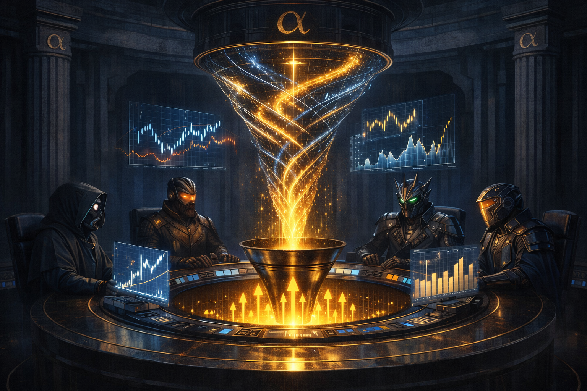
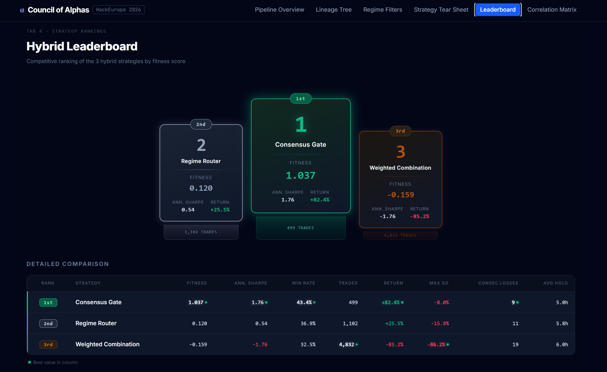
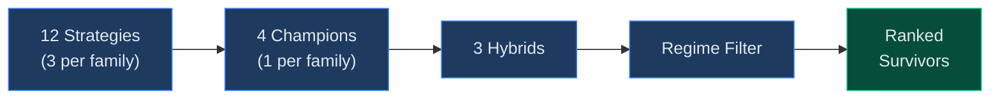
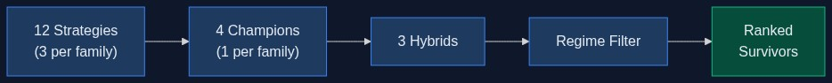

<h1 align="center">Council of Alphas</h1>

<p align="center">
  
</p>

<p align="center">
  <b>HackEurope 2026 | Team: The Greeks (Andreas + Markos)</b><br>
  <a href="https://council-of-alphas.vercel.app">Live Dashboard</a> | <a href="https://www.hackeurope.com/">HackEurope</a>
</p>

Council of Alphas is an evolutionary multi-agent framework that addresses both the mode collapse problem in LLM strategy generation and the evaluation cost of pure evolutionary search. Left unconstrained, LLMs tend to converge on a narrow set of familiar trading strategies. Pure evolutionary search avoids this but requires prohibitively many candidate evaluations. Our approach borrows the structure of evolutionary algorithms - speciation, niche-preserving selection, and hybridization - to enforce diversity on LLM-generated candidates, while using the LLM as the generation operator to produce higher-quality starting points than random mutation would. Four specialist agents, each locked to a distinct strategy family with randomized indicator subsets, generate candidates that are diverse by construction. Niche selection preserves one champion per family, and deterministic hybridization recombines them into three architectures that blend their complementary strengths. A regime-aware filter then sharpens each hybrid by keeping trades only in market conditions where it has demonstrated positive performance, silencing it everywhere else. The result is a pipeline that produces diverse, refined strategies in a single round of LLM calls and one deterministic optimization pass.

<p align="center">
  
</p>

## How It Works



<details>
<summary>View as image (mobile fallback)</summary>
<br>

</details>

1. **Speciation** - 4 LLM specialists (Claude Opus) each generate 3 strategies for their family (trend, momentum, volatility, volume)
2. **Selection** - Best strategy per family becomes a champion (fitness = Sharpe x ln(N) x coverage)
3. **Hybridization** - 3 hybrid templates combine all 4 champions (Consensus Gate, Regime Router, Weighted Combination)
4. **Regime Filter** - Deterministic 2D filter disables trading in unprofitable regime buckets (session x trend x volatility)
5. **Ranking** - Survivors ranked by fitness score

## Example Results

| Rank | Strategy             | Ann. Sharpe | Win Rate | Trades | Return | Max DD  |
|:----:|:---------------------|:-----------:|:--------:|:------:|:------:|:-------:|
| #1   | Consensus Gate       | 1.76        | 43.4%    | 499    | +82.4% | -8.0%   |
| #2   | Regime Router        | 0.54        | 36.9%    | 1,102  | +25.5% | -15.9%  |
| #3   | Weighted Combination | -1.76       | 32.5%    | 4,832  | -85.2% | -86.2%  |

<sub>Example run on SOL/USD 1h candles, 36k bars (Jan 2022 - Feb 2026), $100k initial, 0.5% risk/trade, TBM 2.0/1.0/24h</sub>

## Tech Stack

| Layer      | Tools                                        |
|:-----------|:---------------------------------------------|
| Backend    | Python, Claude Opus API, numba, pandas, asyncio |
| Frontend   | React, Vite, Tailwind CSS, Recharts          |
| Deployment | Vercel                                       |

## Repo Structure

```
core/       State matrix builder, Triple Barrier labeling, backtester, diagnostics
pipeline/   LLM specialists, indicator sampling, champion selection, hybrid builder, fitness
optimizer/  Deterministic 2D regime optimizer
ui/         React dashboard (6 tabs: pipeline, lineage, regimes, tearsheet, leaderboard, correlation)
eda/        Jupyter notebooks for state matrix EDA and winner analysis
data/       SOL/USD 1h parquet, state matrix, pipeline results
docs/       Master spec, architecture, research notes
```

## Run

```bash
# Pipeline
pip install -r requirements.txt
python run_stage3.py

# Dashboard
cd ui && npm install && npm run dev
```

## Team

<table>
  <tr>
    <td align="center">
      <a href="https://github.com/apattichis">
        <br>
        <sub><b>Andreas Pattichis</b></sub>
      </a>
    </td>
    <td align="center">
      <a href="https://github.com/MarkosMarkides">
        <br>
        <sub><b>Markos Markides</b></sub>
      </a>
    </td>
  </tr>
</table>
