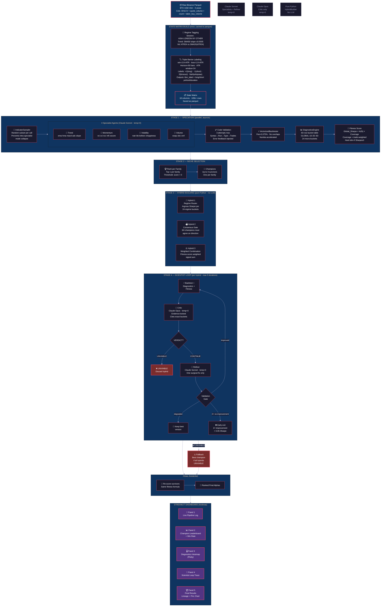

# Architecture

```mermaid
%%{init: {
  'theme': 'base',
  'themeVariables': {
    'primaryColor': '#1a1a2e',
    'primaryTextColor': '#ffffff',
    'primaryBorderColor': '#e94560',
    'lineColor': '#a3a3c2',
    'secondaryColor': '#16213e',
    'tertiaryColor': '#0f3460',
    'fontSize': '13px'
  }
}}%%

flowchart TD

    %% ── DATA LAYER ──────────────────────────────────────────
    RAW["📦 Raw Binance Parquet<br>BTC-USD 15m · 3 years<br>Cols: OHLCV + quote_volume + count + taker_buy_volume"]

    subgraph SM["STATE MATRIX BUILD (once, cached to parquet)"]
        direction TB
        REGIME["🔀 Regime Tagging<br>Session: ASIA·LONDON·NY·OTHER<br>Trend: SMA50 slope ±0.0005<br>Vol: ATR24 vs SMA20(ATR24)"]
        TBM["🏷️ Triple Barrier Labeling<br>win=2.0×ATR · loss=1.0×ATR<br>Horizon=50 bars · ATR window=24<br>Labels: +1(long) · -1(short) · 0(timeout) · NaN(whipsaw)<br>Outputs: tbm_label + long/short pnl/exit/duration"]
        MATRIX["📋 State Matrix<br>18 columns · 105k+ rows<br>Saved as parquet"]
        REGIME --> TBM --> MATRIX
    end

    RAW --> SM

    %% ── STAGE 1: SPECIATION ──────────────────────────────────
    subgraph S1["STAGE 1 — SPECIATION (parallel, asyncio)"]
        direction LR

        SAMPLER["🎲 IndicatorSampler<br>Random subset per call<br>Prevents intra-specialist<br>mode collapse"]

        subgraph SPECS["4 Specialist Agents (Claude Sonnet · temp=0)"]
            direction TB
            SP1["🧬 Trend<br>ema·hma·macd·adx·slope"]
            SP2["🧬 Momentum<br>rsi·cci·roc·mfi·zscore"]
            SP3["🧬 Volatility<br>natr·bb·keltner·choppiness"]
            SP4["🧬 Volume<br>vwap·obv·cmf"]
        end

        VALIDATE["✅ Code Validation<br>3 attempts max<br>Syntax→Run→Type→Trades<br>Error feedback injected"]
        BACKTEST1["⚡ VectorizedBacktester<br>Fee=0.075% · No overlaps<br>Numba accelerated"]
        DIAG1["📊 DiagnosticsEngine<br>60-row bucket table<br>GLOBAL·1D·2D·3D<br>24 micro-buckets"]
        FIT1["🎯 Fitness Score<br>Global_Sharpe × ln(N) × Coverage<br>Coverage = trade-weighted<br>Hard elim if Sharpe≤0"]

        SAMPLER --> SPECS
        SPECS --> VALIDATE --> BACKTEST1 --> DIAG1 --> FIT1
    end

    MATRIX --> S1

    %% ── STAGE 2: NICHE SELECTION ─────────────────────────────
    subgraph S2["STAGE 2 — NICHE SELECTION"]
        direction LR
        RANK["🏆 Rank per Family<br>Top 1 per family<br>Threshold: score > 0"]
        CHAMPS["👑 Champions<br>Up to 4 survivors<br>One per family"]
        RANK --> CHAMPS
    end

    S1 --> S2

    %% ── STAGE 3: HYBRID BUILDING ─────────────────────────────
    subgraph S3["STAGE 3 — HYBRID BUILDING (pure Python · no LLM)"]
        direction LR
        H1["🔀 Hybrid 1<br>Regime Router<br>Argmax Sharpe per<br>24 regime buckets"]
        H2["🗳️ Hybrid 2<br>Consensus Gate<br>3/4 champions must<br>agree on direction"]
        H3["⚖️ Hybrid 3<br>Weighted Combination<br>Fitness-score weighted<br>signal sum"]
    end

    S2 --> S3

    %% ── STAGE 4: SCIENTIST LOOP ──────────────────────────────
    subgraph S4["STAGE 4 — SCIENTIST LOOP (per hybrid · max 5 iterations)"]
        direction TB
        BT2["⚡ Backtest +<br>Diagnostics +<br>Fitness"]
        CRITIC["🔬 Critic<br>Claude Opus · temp=0<br>Evidence-locked<br>Cites exact buckets"]
        VERDICT{"VERDICT?"}
        REFINER["🔧 Refiner<br>Claude Sonnet · temp=0<br>One surgical fix only"]
        VGATE{"Validation<br>Gate"}
        UNVIABLE["❌ UNVIABLE<br>Discard hybrid"]
        KEEP["💾 Keep best<br>version"]
        EARLY["⏹️ Early exit<br>2× improvement<br>< 0.05 Sharpe"]

        BT2 --> CRITIC --> VERDICT
        VERDICT -->|UNVIABLE| UNVIABLE
        VERDICT -->|CONTINUE| REFINER
        REFINER --> VGATE
        VGATE -->|improved| BT2
        VGATE -->|degraded| KEEP
        VGATE -->|2× no improvement| EARLY
    end

    S3 --> S4

    %% ── FALLBACK ─────────────────────────────────────────────
    FALLBACK["⚠️ Fallback<br>Best champion<br>if all hybrids<br>UNVIABLE"]

    S4 -->|all UNVIABLE| FALLBACK

    %% ── FINAL RANKING ────────────────────────────────────────
    subgraph RANK2["FINAL RANKING"]
        SCORE["🎯 Re-score survivors<br>Same fitness formula"]
        PODIUM["🏅 Ranked Final Alphas"]
        SCORE --> PODIUM
    end

    S4 --> RANK2
    FALLBACK --> RANK2

    %% ── UI ───────────────────────────────────────────────────
    subgraph UI["STREAMLIT DASHBOARD (Andreas)"]
        direction LR
        P1["📡 Panel 1<br>Live Pipeline Log"]
        P2["📊 Panel 2<br>Champion Leaderboard<br>+ Win Rate"]
        P3["🌡️ Panel 3<br>Diagnostics Heatmap<br>(Plotly)"]
        P4["🔬 Panel 4<br>Scientist Loop Trace"]
        P5["🏆 Panel 5<br>Final Results<br>Lineage + PnL Chart"]
    end

    RANK2 --> UI

    %% ── MODEL LABELS ─────────────────────────────────────────
    SONNET["Claude Sonnet<br>Specialists + Refiner<br>temp=0"]
    OPUS["Claude Opus<br>Critic only<br>temp=0"]
    PYTHON["Pure Python<br>HybridBuilder<br>No LLM"]

    %% ── STYLING ──────────────────────────────────────────────
    classDef dataNode fill:#0f3460,stroke:#e94560,stroke-width:2px,color:#fff
    classDef stageBox fill:#16213e,stroke:#e94560,stroke-width:1px,color:#fff
    classDef modelTag fill:#1a1a2e,stroke:#a3a3c2,stroke-width:1px,color:#a3a3c2,stroke-dasharray:5 5
    classDef outputNode fill:#533483,stroke:#e94560,stroke-width:2px,color:#fff
    classDef warningNode fill:#7a2c2c,stroke:#e94560,stroke-width:2px,color:#fff

    class RAW,MATRIX dataNode
    class P1,P2,P3,P4,P5 outputNode
    class UNVIABLE,FALLBACK warningNode
    class SONNET,OPUS,PYTHON modelTag
```
