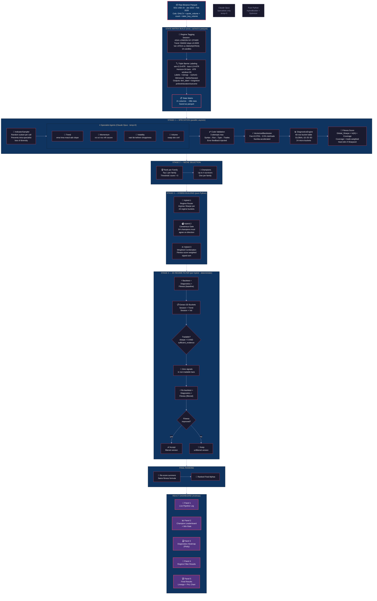

# Architecture

```mermaid
%%{init: {
  'theme': 'base',
  'themeVariables': {
    'primaryColor': '#1a1a2e',
    'primaryTextColor': '#ffffff',
    'primaryBorderColor': '#e94560',
    'lineColor': '#a3a3c2',
    'secondaryColor': '#16213e',
    'tertiaryColor': '#0f3460',
    'fontSize': '13px'
  }
}}%%

flowchart TD

    %% ── DATA LAYER ──────────────────────────────────────────
    RAW["📦 Raw Binance Parquet<br>SOL-USD 1h · Jan 2022 - Feb 2026<br>Cols: OHLCV + quote_volume + count + taker_buy_volume"]

    subgraph SM["STATE MATRIX BUILD (once, cached to parquet)"]
        direction TB
        REGIME["🔀 Regime Tagging<br>Session: ASIA·LONDON·NY·OTHER<br>Trend: SMA50 slope ±0.0005<br>Vol: ATR24 vs SMA20(ATR24)<br>1h candles"]
        TBM["🏷️ Triple Barrier Labeling<br>win=2.0×ATR · loss=1.0×ATR<br>Horizon=24 bars · ATR window=24<br>Labels: +1(long) · -1(short) · 0(timeout) · NaN(whipsaw)<br>Outputs: tbm_label + long/short pnl/exit/duration/outcome"]
        MATRIX["📋 State Matrix<br>21 columns · ~36k rows<br>Saved as parquet"]
        REGIME --> TBM --> MATRIX
    end

    RAW --> SM

    %% ── STAGE 1: SPECIATION ──────────────────────────────────
    subgraph S1["STAGE 1 — SPECIATION (parallel, asyncio)"]
        direction LR

        SAMPLER["🎲 IndicatorSampler<br>Random subset per call<br>Prevents intra-specialist<br>loss of diversity"]

        subgraph SPECS["4 Specialist Agents (Claude Opus · temp=0)"]
            direction TB
            SP1["🧬 Trend<br>ema·hma·macd·adx·slope"]
            SP2["🧬 Momentum<br>rsi·cci·roc·mfi·zscore"]
            SP3["🧬 Volatility<br>natr·bb·keltner·choppiness"]
            SP4["🧬 Volume<br>vwap·obv·cmf"]
        end

        VALIDATE["✅ Code Validation<br>3 attempts max<br>Syntax→Run→Type→Trades<br>Error feedback injected"]
        BACKTEST1["⚡ VectorizedBacktester<br>Fee=0.075% · 0.5% risk/trade<br>Numba accelerated"]
        DIAG1["📊 DiagnosticsEngine<br>60-row bucket table<br>GLOBAL·1D·2D·3D<br>24 micro-buckets"]
        FIT1["🎯 Fitness Score<br>Global_Sharpe × ln(N) × Coverage<br>Coverage = trade-weighted<br>Hard elim if Sharpe≤0"]

        SAMPLER --> SPECS
        SPECS --> VALIDATE --> BACKTEST1 --> DIAG1 --> FIT1
    end

    MATRIX --> S1

    %% ── STAGE 2: NICHE SELECTION ─────────────────────────────
    subgraph S2["STAGE 2 — NICHE SELECTION"]
        direction LR
        RANK["🏆 Rank per Family<br>Top 1 per family<br>Threshold: score > 0"]
        CHAMPS["👑 Champions<br>Up to 4 survivors<br>One per family"]
        RANK --> CHAMPS
    end

    S1 --> S2

    %% ── STAGE 3: HYBRID BUILDING ─────────────────────────────
    subgraph S3["STAGE 3 — HYBRID BUILDING (pure Python)"]
        direction LR
        H1["🔀 Hybrid 1<br>Regime Router<br>Argmax Sharpe per<br>24 regime buckets"]
        H2["🗳️ Hybrid 2<br>Consensus Gate<br>3/4 champions must<br>agree on direction"]
        H3["⚖️ Hybrid 3<br>Weighted Combination<br>Fitness-score weighted<br>signal sum"]
    end

    S2 --> S3

    %% ── STAGE 4: 2D REGIME FILTER ────────────────────────────
    subgraph S4["STAGE 4 — 2D REGIME FILTER (per hybrid · deterministic)"]
        direction TB
        BT2["⚡ Backtest +<br>Diagnostics +<br>Fitness (baseline)"]
        EXTRACT["📋 Extract 2D Buckets<br>Session × Trend<br>Session × Vol"]
        TRADABLE{"Tradable?<br>sharpe > 0 AND<br>sufficient_evidence"}
        ZERO["🚫 Zero signals<br>in non-tradable bars"]
        REEVAL["⚡ Re-backtest +<br>Diagnostics +<br>Fitness (filtered)"]
        GATE{"Fitness<br>improved?"}
        ACCEPT["✅ Accept<br>filtered version"]
        REJECT["💾 Keep<br>unfiltered version"]

        BT2 --> EXTRACT --> TRADABLE
        TRADABLE --> ZERO --> REEVAL --> GATE
        GATE -->|yes| ACCEPT
        GATE -->|no| REJECT
    end

    S3 --> S4

    %% ── FINAL RANKING ────────────────────────────────────────
    subgraph RANK2["FINAL RANKING"]
        SCORE["🎯 Re-score survivors<br>Same fitness formula"]
        PODIUM["🏅 Ranked Final Alphas"]
        SCORE --> PODIUM
    end

    S4 --> RANK2

    %% ── UI ───────────────────────────────────────────────────
    subgraph UI["REACT DASHBOARD (Andreas)"]
        direction LR
        P1["📡 Panel 1<br>Live Pipeline Log"]
        P2["📊 Panel 2<br>Champion Leaderboard<br>+ Win Rate"]
        P3["🌡️ Panel 3<br>Diagnostics Heatmap<br>(Plotly)"]
        P4["🔀 Panel 4<br>Regime Filter Results"]
        P5["🏆 Panel 5<br>Final Results<br>Lineage + PnL Chart"]
    end

    RANK2 --> UI

    %% ── MODEL LABELS ─────────────────────────────────────────
    OPUS["Claude Opus<br>Specialists only<br>temp=0"]
    PYTHON["Pure Python<br>HybridBuilder +<br>Optimizer"]

    %% ── STYLING ──────────────────────────────────────────────
    classDef dataNode fill:#0f3460,stroke:#e94560,stroke-width:2px,color:#fff
    classDef stageBox fill:#16213e,stroke:#e94560,stroke-width:1px,color:#fff
    classDef modelTag fill:#1a1a2e,stroke:#a3a3c2,stroke-width:1px,color:#a3a3c2,stroke-dasharray:5 5
    classDef outputNode fill:#533483,stroke:#e94560,stroke-width:2px,color:#fff
    classDef warningNode fill:#7a2c2c,stroke:#e94560,stroke-width:2px,color:#fff

    class RAW,MATRIX dataNode
    class P1,P2,P3,P4,P5 outputNode
    class OPUS,PYTHON modelTag
```
